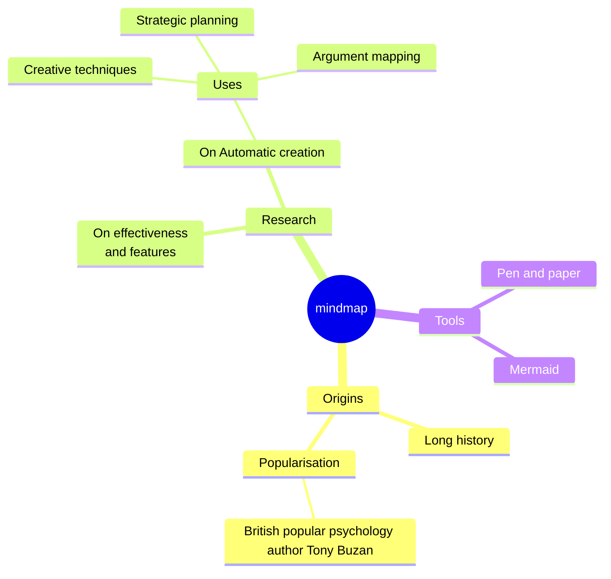

# debugging-containerized-python-applications
Debugging containerized Python applications


## Sample Python app

```bash
make build-sample-app

make run-sample-app
```


### PuDB

```bash
docker build -t pudb-debug -f Dockerfile-pudb-debug .
docker run pudb-debug -p 6899:6899
```

open separate terminal: 
```bash
telnet 127.0.0.1 6899
```


