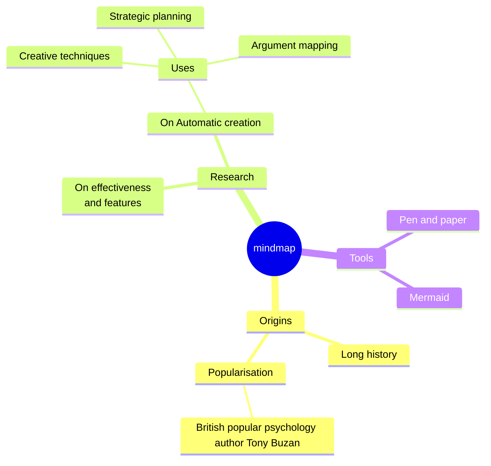

# debugging-containerized-python-applications
Debugging containerized Python applications


## Sample Python app

```bash
make build-sample-app

make run-sample-app
```

### debugpy

```
docker build -f Dockerfile-debugpy -t asoldatenko/py-sample-app-debug .
docker run 
```

### PuDB

```bash
docker build -t pudb-debug -f Dockerfile-pudb-debug .
docker run pudb-debug -p 6899:6899
```

podman run -p 6899:6899 pudb-debug

open separate terminal: 
```bash
telnet 127.0.0.1 6899
```





## Add git-sha

```
docker build -f Dockerfile-debugpy-sha --build-arg GIT_HASH=${GIT_HASH::7} -t asoldatenko/py-sample-app-debug .
docker run --rm asoldatenko/py-sample-app-debug env | grep GIT_HASH

GIT_HASH=80907a7
```

